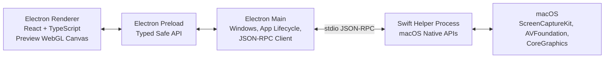
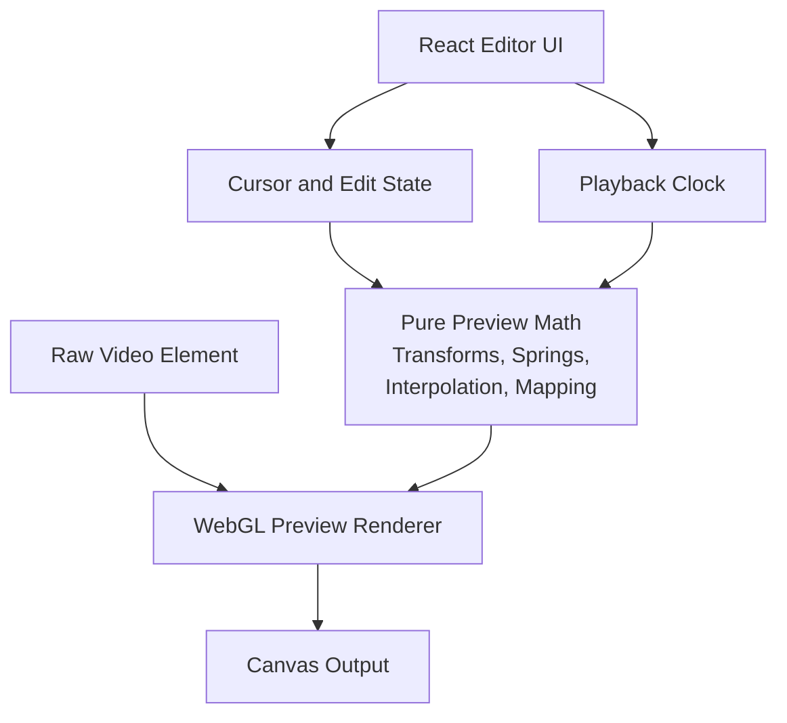

# System Architecture

Last updated: May 26, 2026

## 1. Purpose

This document defines the V1 technical stack and system architecture for Open Studio.

It focuses on process boundaries, runtime responsibilities, native integration, preview rendering, inter-process communication, and testing strategy. It intentionally does not define the project data model, package schema, or detailed UI design.

## 2. Architecture Goals

- Ship a focused macOS V1 while keeping the app shell compatible with future cross-platform direction.
- Keep macOS-native capture and system functionality isolated from the Electron UI.
- Implement the editor preview entirely in the Electron renderer using browser rendering technologies.
- Use a typed, testable JSON-RPC boundary between Electron and Swift.
- Keep recording, native event capture, preview composition, and export responsibilities clearly separated.
- Favor deterministic tests for UI, IPC, rendering math, and native process behavior.

## 3. Technology Stack

### 3.1 Desktop App

- **Runtime:** Electron.
- **Build tooling:** electron-vite.
- **Language:** TypeScript.
- **Renderer framework:** React.
- **Renderer graphics:** WebGL-backed canvas rendering for final V1 preview composition.
- **Main process runtime:** Node.js inside Electron main.
- **Native runtime:** Swift helper process for macOS functionality.
- **IPC between Electron and Swift:** JSON-RPC over stdio.

### 3.2 Preview Rendering Stack

The V1 preview is implemented completely in the Electron renderer process.

Recommended preview stack:

- Use `HTMLVideoElement` as the raw recording playback source.
- Use a WebGL-backed canvas layer for transformed video presentation, zoom, pan, cursor compositing, click effects if added, interpolation, and motion blur.
- Use React for editor controls and timeline UI, not for per-frame rendering.
- Keep timeline math, zoom interpolation, cursor interpolation, coordinate mapping, and spring calculations in pure TypeScript modules.
- Keep WebGL draw calls behind a small renderer abstraction so preview math can be unit tested without a GPU context.

Recommended V1 implementation options:

- **Preferred:** PixiJS for WebGL scene composition if it fits the preview model cleanly.
- **Acceptable:** A small custom WebGL renderer if PixiJS adds too much abstraction around video textures and frame-accurate control.
- **Prototype only:** Canvas 2D for early experiments. It should not be the assumed final renderer for V1 because transform-heavy preview, blur, and cursor compositing need smoother GPU-backed behavior.

WebGPU should not be the default V1 choice unless a later spike proves it is needed and stable enough for the target macOS/Electron runtime.

### 3.3 Native Stack

The Swift helper owns macOS-only functionality:

- Screen Recording permission checks and recovery-state reporting.
- Display enumeration.
- Screen capture setup and control.
- Mouse movement and click event capture.
- Native media/file operations that require macOS APIs.
- Export orchestration when native media APIs are required.

The Swift helper exposes no UI. It should be signed and packaged with the Electron app.

## 4. Runtime Architecture

## 5. Process Responsibilities

### 5.1 Electron Renderer

The renderer owns user-facing application surfaces:

- Recording picker UI.
- Compact recording stop control.
- Editor layout.
- Timeline controls.
- Zoom segment editing UI.
- Cursor setting controls.
- Export progress and completion UI.
- Complete preview playback and visual composition.

The renderer must not directly access Node.js, the filesystem, or native process APIs. It talks to the app through a typed preload API.

The renderer owns preview frame composition:

- Reads raw video through browser media primitives.
- Applies zoom and pan transforms.
- Renders the high-resolution cursor overlay.
- Applies cursor motion interpolation.
- Applies zoom and pan animation.
- Applies preview motion blur or blur approximations.
- Keeps playback, scrubbing, and timeline state responsive.

### 5.2 Electron Preload

The preload layer exposes a narrow, typed bridge from renderer to main.

It should:

- Expose explicit app commands instead of generic IPC send/receive access.
- Validate message shapes at the boundary where practical.
- Prevent renderer access to Node.js primitives.
- Provide event subscriptions for recording, export, permission, and native-helper status changes.

### 5.3 Electron Main

The main process owns desktop application coordination:

- App lifecycle.
- Window creation and routing.
- Menu behavior.
- Dialogs and platform shell integration.
- Launching, monitoring, and terminating the Swift helper.
- JSON-RPC client implementation over helper stdio.
- Request correlation, timeout handling, cancellation, and progress-event forwarding.
- Translating native-helper failures into structured renderer-facing errors.

The main process should not implement preview rendering. It may coordinate export requests and project/file operations, but visual preview composition belongs to the renderer.

### 5.4 Swift Helper

The Swift helper owns native capability, not app orchestration.

It should:

- Start as a child process spawned by Electron main.
- Read JSON-RPC requests from stdin.
- Write JSON-RPC responses and events to stdout.
- Write diagnostic logs to stderr or a dedicated log sink, never mixed into stdout JSON-RPC frames.
- Keep native state machines explicit for permission, display listing, recording, capture finalization, and export.
- Return structured errors with stable codes.

The helper should be independently testable without launching Electron.

## 6. JSON-RPC Boundary

### 6.1 Transport

- Transport is stdio between Electron main and the Swift helper.
- Messages use JSON-RPC-style request IDs for correlation.
- stdout is reserved for protocol messages.
- stderr is reserved for logs and diagnostics.
- The main process owns helper lifecycle and restart behavior.

### 6.2 Contract Principles

- Define protocol types in TypeScript first for the Electron side.
- Mirror protocol types in Swift using `Codable`.
- Keep request and event names stable and versionable.
- Use explicit command groups such as permissions, displays, recording, export, and health.
- Treat progress and long-running state changes as events, not polling-only responses.
- Support cancellation for long-running native operations.
- Keep preview-only rendering commands out of the Swift helper.

### 6.3 Example Command Groups

- `health.ping`
- `permissions.getScreenRecordingStatus`
- `permissions.openScreenRecordingSettings`
- `displays.list`
- `recording.start`
- `recording.stop`
- `recording.cancel`
- `export.start`
- `export.cancel`

### 6.4 Example Event Groups

- `helper.ready`
- `helper.error`
- `permissions.changed`
- `recording.started`
- `recording.progress`
- `recording.completed`
- `recording.failed`
- `export.progress`
- `export.completed`
- `export.failed`

## 7. Preview Architecture

The preview pipeline should be split into pure calculation modules and an imperative graphics adapter.

Preview implementation rules:

- React updates user intent and editor state.
- `requestAnimationFrame` drives preview drawing during playback and scrubbing.
- Pure TypeScript modules compute the render state for a given timestamp.
- The WebGL renderer receives a render-state object and draws the frame.
- The preview renderer must be disposable so editor windows can close without leaving GPU or media resources alive.
- Preview behavior should be deterministic for a fixed video timestamp and edit state.

## 8. Error, Progress, and Cancellation Strategy

- Native failures should cross the Swift-to-main boundary as structured JSON-RPC errors.
- Main process should map native errors to renderer-safe errors with user-actionable categories.
- Long-running operations need progress events.
- Recording and export both need cancellation paths.
- Helper crashes should be detected by Electron main and surfaced as recoverable app errors where possible.
- Protocol logs must not corrupt stdout JSON-RPC messages.

## 9. Testing Strategy

### 9.1 React Renderer Tests

Use:

- **Vitest** as the test runner.
- **React Testing Library** for component tests.
- **@testing-library/user-event** for realistic user interactions.
- **@testing-library/jest-dom** for DOM assertions.
- **jsdom** for standard renderer unit and component tests.

Test:

- Recording picker state transitions.
- Editor controls.
- Timeline interactions.
- Export progress UI.
- Accessibility labels for primary controls.
- Pure preview math, including zoom interpolation, cursor interpolation, coordinate mapping, and spring calculations.

### 9.2 Preview Graphics Tests

Use:

- **Playwright** for browser-level rendering tests.
- Deterministic preview fixtures.
- Screenshot comparisons for broad visual regressions.
- Targeted canvas pixel checks for critical preview composition behavior.

Test:

- Video frame presentation.
- Zoom and pan transforms.
- Cursor overlay position and scale.
- Scrubbing render correctness.
- Motion interpolation at selected timestamps.
- Renderer cleanup when closing or switching projects.

jsdom should not be used to validate WebGL rendering behavior.

### 9.3 Electron Main Process Tests

Use:

- **Vitest** with the Node test environment.
- Node stream mocks for stdio JSON-RPC.
- Fake helper processes for integration tests.

Test:

- Swift helper launch and shutdown behavior.
- JSON-RPC request correlation.
- Timeout handling.
- Cancellation behavior.
- Progress event forwarding.
- Helper crash handling.
- Structured error translation.

Integration tests should include a fake Swift helper executable or script that speaks the same JSON-RPC protocol over stdio. This keeps CI deterministic without requiring real macOS capture permissions for most tests.

### 9.4 End-to-End Tests

Use:

- **Playwright Electron automation** for app-level workflows.

Test:

- App launch.
- Recording picker workflow with a fake helper.
- Permission-denied state with a fake helper.
- Opening the editor after a fake recording completion.
- Timeline and preview smoke behavior with deterministic fixtures.
- Export progress and completion UI with a fake helper.

Keep most E2E tests fake-helper based. Add a small macOS-only native E2E suite later for real display enumeration, permission behavior, and short capture/export validation.

### 9.5 Swift Tests

Use:

- **Swift Testing** for new pure Swift unit tests.
- **XCTest** where Apple framework integration, process behavior, performance measurement, or Xcode tooling makes it more practical.

Test:

- JSON-RPC decoding and encoding.
- Command routing.
- Error encoding.
- Permission-state mapping.
- Display enumeration adapters.
- Recording state machine behavior.
- Export state machine behavior.
- Helper stdio framing.

Swift tests should run independently from Electron wherever possible.

## 10. Non-Goals

This document does not define:

- Project package schema.
- Persistent data model.
- Detailed UI design.
- Detailed export encoding settings.
- Product roadmap beyond V1.
- Cloud, account, collaboration, or sharing architecture.

## 11. Recommended Initial Engineering Order

1. Scaffold Electron with electron-vite, React, and TypeScript.
2. Scaffold the Swift helper as an independently runnable process.
3. Implement a minimal JSON-RPC stdio bridge with `health.ping`.
4. Add Vitest coverage for renderer pure logic and Electron main JSON-RPC client behavior.
5. Add Swift tests for JSON-RPC decoding and command routing.
6. Add a fake helper for deterministic Electron integration and E2E tests.
7. Prototype renderer preview with `HTMLVideoElement` plus WebGL canvas before building full editor controls.
