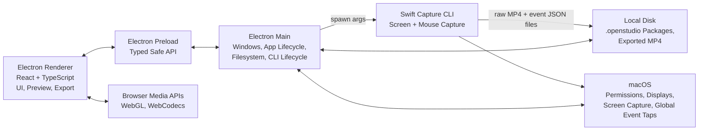
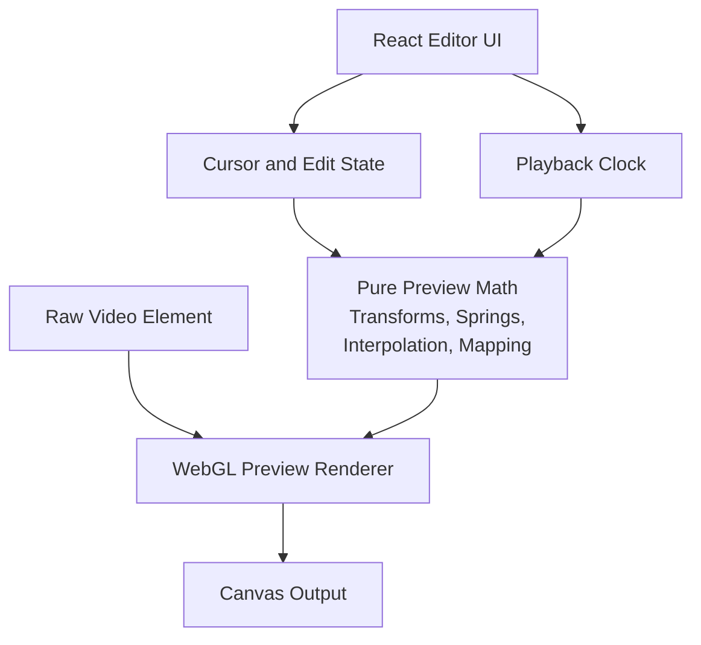
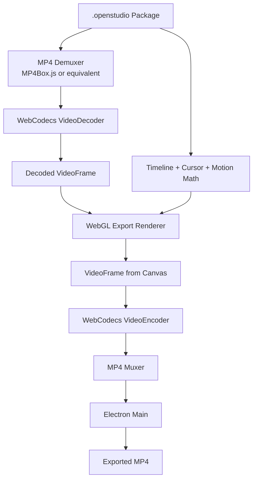

# System Architecture

Last updated: May 28, 2026

## 1. Purpose

This document defines the V1 technical stack and system architecture for Open Studio.

It focuses on process boundaries, runtime responsibilities, native integration, recording capture, preview rendering, export rendering, inter-process communication, and testing strategy. It intentionally does not define the project data model, package schema, or detailed UI design.

## 2. Architecture Goals

- Ship a focused macOS V1 while keeping the app shell compatible with future cross-platform direction.
- Keep the Electron renderer responsible for UI, preview composition, and export composition.
- Keep filesystem access, process spawning, app lifecycle, and project package writes inside Electron main.
- Use a Swift CLI for selected-display screen capture, global mouse movement capture, and mouse click capture.
- Avoid a long-lived Swift helper process and avoid JSON-RPC between Electron and Swift.
- Keep native recording capture, preview composition, and export responsibilities clearly separated.
- Favor deterministic tests for UI, IPC, rendering math, export media pipelines, and native CLI lifecycle behavior.

## 3. Technology Stack

### 3.1 Desktop App

- **Runtime:** Electron.
- **Build tooling:** electron-vite.
- **Language:** TypeScript.
- **Renderer framework:** React.
- **Renderer graphics:** WebGL-backed canvas rendering for preview and export composition.
- **Main process runtime:** Node.js inside Electron main.
- **Native runtime:** Swift CLI executable for selected-display screen capture and global mouse event capture.
- **IPC:** Typed Electron preload APIs between renderer and main. The Swift CLI uses process arguments, output files, stderr diagnostics, and exit codes.

### 3.2 Recording Capture Stack

The Swift CLI owns native recording capture. It captures the selected display without the system cursor, records cursor movement and click metadata, and produces the raw H.264 MP4 recording plus event JSON files for the project package.

The main process owns recording orchestration and final package writes. It creates the temporary workspace, passes absolute output paths to the Swift CLI, monitors the child process, and validates all capture artifacts before finalizing the project package.

The Swift CLI writes only to paths provided by main:

- Raw cursor-free H.264 MP4.
- Mouse movement samples.
- Mouse click events.
- Timestamps aligned to the recording start time.
- Coordinates aligned to the selected display pixel space.

### 3.3 Preview Rendering Stack

The V1 preview is implemented completely in the Electron renderer process.

Recommended preview stack:

- Use `HTMLVideoElement` as the raw recording playback source.
- Use a WebGL-backed canvas layer for transformed video presentation, zoom, pan, cursor compositing, click effects if added, interpolation, and motion blur.
- Use React for editor controls and timeline UI, not for per-frame rendering.
- Keep timeline math, zoom interpolation, cursor interpolation, coordinate mapping, and spring calculations in pure TypeScript modules.
- Keep WebGL draw calls behind a small renderer abstraction so preview math can be unit tested without a GPU context.

Recommended V1 implementation options:

- **Preferred:** PixiJS for WebGL scene composition if it fits the preview and export model cleanly.
- **Acceptable:** A small custom WebGL renderer if PixiJS adds too much abstraction around video textures and frame-accurate control.
- **Prototype only:** Canvas 2D for early experiments. It should not be the assumed final renderer for V1 because transform-heavy preview, blur, and cursor compositing need smoother GPU-backed behavior.

WebGPU should not be the default V1 choice unless a later spike proves it is needed and stable enough for the target macOS/Electron runtime.

### 3.4 Export Rendering Stack

Export uses the browser media API technique described in "Fast video rendering and encoding using web APIs": https://pietrasiak.com/fast-video-rendering-and-encoding-using-web-apis.

The export pipeline should:

- Run in a dedicated renderer-side export surface or worker-like renderer context.
- Demux the raw MP4 with a library such as MP4Box.js.
- Decode source video frames with WebCodecs `VideoDecoder`.
- Convert decoded `VideoFrame` objects into WebGL textures without reading pixels into JavaScript memory.
- Render each output frame through the same WebGL composition path used by preview.
- Create a new `VideoFrame` directly from the export canvas.
- Encode frames with WebCodecs `VideoEncoder`.
- Mux encoded video chunks into the final MP4 container.
- Send encoded chunks or the completed MP4 data to Electron main for filesystem persistence.

Export must avoid `canvas.readPixels`, per-frame PNG dumps, and raw pixel transfer through JavaScript memory.

## 4. Runtime Architecture



## 5. Process Responsibilities

### 5.1 Electron Renderer

The renderer owns user-facing application surfaces:

- Recording picker UI.
- Compact recording stop control.
- Editor layout.
- Timeline controls.
- Zoom segment editing UI.
- Cursor setting controls.
- Export progress and completion UI.
- Complete preview playback and visual composition.

The renderer owns browser-native preview and export work:

- Running preview playback with `HTMLVideoElement` and WebGL.
- Running deterministic export rendering and encoding with WebGL and WebCodecs.
- Reporting recording and export progress through preload APIs.

The renderer must not directly access Node.js, the filesystem, or native process APIs. It talks to the app through a typed preload API.

### 5.2 Electron Preload

The preload layer exposes a narrow, typed bridge from renderer to main.

It should:

- Expose explicit app commands instead of generic IPC send/receive access.
- Validate message shapes at the boundary where practical.
- Prevent renderer access to Node.js primitives.
- Provide event subscriptions for recording, export, permission, and app status changes.
- Provide explicit recording, export, progress, and cancellation APIs.

### 5.3 Electron Main

The main process owns desktop application coordination:

- App lifecycle.
- Window creation and routing.
- Menu behavior.
- Dialogs and platform shell integration.
- Permission coordination and recovery flows.
- Display/source selection support.
- Temporary recording workspaces.
- Project package creation and schema migrations.
- All filesystem writes for raw recordings, event JSON files, project JSON, and exported MP4 files.
- Launching, monitoring, stopping, and terminating the Swift capture CLI.
- Translating capture, CLI, package, and export failures into structured renderer-facing errors.

The main process should not implement preview rendering or export frame composition. It coordinates export requests and persists output, but visual rendering and encoding belong to the renderer-side browser pipeline.

### 5.4 Swift Capture CLI

The Swift CLI owns native recording capture, not app orchestration or package layout.

It should:

- Start as a child process spawned by Electron main.
- Receive all required configuration as command-line arguments.
- Capture the selected display as a cursor-free H.264 MP4 at 60 FPS.
- Capture global mouse movement and click events using macOS APIs.
- Write the raw recording to `media/raw-recording.mp4`.
- Write cursor movement events to `events/cursor-movements.json`.
- Write mouse click events to `events/mouse-clicks.json`.
- Align event timestamps to the recording start timestamp provided by main.
- Align coordinates to the selected display pixel space.
- Write diagnostic logs to stderr only.
- Exit `0` after clean stop/finalization.
- Exit nonzero on failure.

The CLI should not write protocol messages to stdout and should not own project package layout decisions.

## 6. Swift Capture CLI Contract

### 6.1 Invocation

Electron main spawns the CLI when recording starts. The exact executable path is packaging-specific, but the argument contract should be stable.

```text
open-studio-capture \
  --recording-id <recordingId> \
  --display-id <displayId> \
  --display-origin-x <px> \
  --display-origin-y <px> \
  --display-width <px> \
  --display-height <px> \
  --display-scale-factor <scale> \
  --recording-started-at <isoTimestamp> \
  --video-output <absolute path to raw-recording.mp4> \
  --cursor-output <absolute path to cursor-movements.json> \
  --click-output <absolute path to mouse-clicks.json>
```

Main owns the temporary workspace and passes absolute output paths. The CLI creates or replaces only the files passed in its arguments.

### 6.2 Stop and Finalization

Main stops the CLI when recording stops. The preferred stop mechanism is a graceful process signal that lets the CLI flush and close the MP4 and both JSON files before exit.

Main treats recording finalization as successful only when:

- The Swift CLI exited with code `0`.
- `raw-recording.mp4` exists and validates as a cursor-free H.264 MP4.
- `cursor-movements.json` exists and validates against schema version 1.
- `mouse-clicks.json` exists and validates against schema version 1.

If the CLI exits nonzero or any capture artifact is missing/invalid, main surfaces a structured recording failure and preserves recoverable artifacts where possible.

### 6.3 Diagnostics

- stderr is diagnostic text for logs and debugging.
- stdout is unused for V1.
- Main may capture stderr for failure details, but user-facing copy belongs in Electron.
- The CLI should keep errors stable enough for main to map common failures into app error codes.

## 7. Preview Architecture

The preview pipeline should be split into pure calculation modules and an imperative graphics adapter.



Preview implementation rules:

- React updates user intent and editor state.
- `requestAnimationFrame` drives preview drawing during playback and scrubbing.
- Pure TypeScript modules compute the render state for a given timestamp.
- The WebGL renderer receives a render-state object and draws the frame.
- The preview renderer must be disposable so editor windows can close without leaving GPU or media resources alive.
- Preview behavior should be deterministic for a fixed video timestamp and edit state.
- Preview playback may tolerate dropped frames because the raw video remains the realtime playback clock.

## 8. Export Architecture

Export is separate from preview because every frame must be correct and deterministic.



Export implementation rules:

- Export advances frame-by-frame at the requested FPS.
- Export must not depend on realtime `HTMLVideoElement` playback.
- Export reuses the same render-state calculation and WebGL composition behavior as preview.
- Source `VideoFrame` objects must be closed as soon as they are no longer needed.
- Encoder queue size must be bounded so renderer memory does not grow without limit.
- Encoded output is handed to main for writing to the Desktop output path.
- Export cancellation must stop decoding, rendering, encoding, muxing, and output writes.

## 9. Error, Progress, and Cancellation Strategy

- Renderer-facing errors use stable app error codes.
- Main maps capture, CLI, filesystem, package, and export persistence errors to renderer-safe errors with user-actionable categories.
- Long-running recording and export operations need progress events.
- Recording and export both need cancellation paths.
- Swift CLI crashes should be detected by Electron main and surfaced as recoverable app errors where possible.
- Renderer export failures should include enough structured context for main to update export history.
- Diagnostic logs must not be treated as protocol data.

## 10. Testing Strategy

### 10.1 React Renderer Tests

Use:

- **Vitest** as the test runner.
- **React Testing Library** for component tests.
- **@testing-library/user-event** for realistic user interactions.
- **@testing-library/jest-dom** for DOM assertions.
- **jsdom** for standard renderer unit and component tests.

Test:

- Recording picker state transitions.
- Editor controls.
- Timeline interactions.
- Export progress UI.
- Accessibility labels for primary controls.
- Pure preview/export math, including zoom interpolation, cursor interpolation, coordinate mapping, and spring calculations.

### 10.2 Preview And Export Graphics Tests

Use:

- **Playwright** for browser-level rendering tests.
- Deterministic preview/export fixtures.
- Screenshot comparisons for broad visual regressions.
- Targeted canvas pixel checks for critical composition behavior.

Test:

- Video frame presentation.
- Zoom and pan transforms.
- Cursor overlay position and scale.
- Scrubbing render correctness.
- Motion interpolation at selected timestamps.
- Renderer cleanup when closing or switching projects.
- Export frame selection at deterministic timestamps.
- Preview/export render-state parity.
- WebCodecs encoder progress and cancellation behavior where available.

jsdom should not be used to validate WebGL or WebCodecs rendering behavior.

### 10.3 Electron Main Process Tests

Use:

- **Vitest** with the Node test environment.
- Fake child-process adapters for Swift CLI lifecycle tests.
- Temporary directories for package and export persistence tests.

Test:

- Swift CLI argument construction.
- CLI launch and shutdown behavior.
- CLI exit-code handling.
- stderr diagnostic capture.
- Missing or invalid raw MP4 and event file handling.
- Temporary workspace creation and cleanup.
- Recording finalization into `.openstudio` packages.
- Export output path allocation and file writes.
- Structured error translation.

### 10.4 End-to-End Tests

Use:

- **Playwright Electron automation** for app-level workflows.

Test:

- App launch.
- Recording picker workflow with fake Swift capture.
- Permission-denied state.
- Opening the editor after fake recording completion.
- Timeline and preview smoke behavior with deterministic fixtures.
- Export progress and completion UI with a mocked renderer export job.

Keep most E2E tests fake Swift capture based. Add a small macOS-only native E2E suite later for real permission behavior, short screen capture, event capture, and export validation.

### 10.5 Swift Tests

Use:

- **Swift Testing** for new pure Swift unit tests.
- **XCTest** where Apple framework integration, process behavior, performance measurement, or Xcode tooling makes it more practical.

Test:

- CLI argument parsing.
- Screen capture adapter behavior.
- Event tap adapters.
- Coordinate mapping to selected display pixels.
- Timestamp alignment across video, cursor movement, and click events.
- JSON event file encoding.
- Graceful stop and flush behavior for MP4 and JSON outputs.
- Nonzero failure exits.

Swift tests should run independently from Electron wherever possible.

## 11. Non-Goals

This document does not define:

- Project package schema.
- Persistent data model.
- Detailed UI design.
- Detailed export encoding settings beyond the browser API architecture.
- Product roadmap beyond V1.
- Cloud, account, collaboration, or sharing architecture.

## 12. Recommended Initial Engineering Order

1. Scaffold Electron with electron-vite, React, and TypeScript.
2. Define typed preload APIs for recording lifecycle, package finalization, and export output persistence.
3. Scaffold the Swift capture CLI as an independently runnable process.
4. Prototype Swift screen capture for a selected display, cursor-free H.264 MP4 finalization, and mouse event capture.
5. Add Electron main lifecycle handling for spawning, stopping, and validating the Swift capture CLI.
6. Add package finalization that imports raw MP4 plus `cursor-movements.json` and `mouse-clicks.json`.
7. Prototype renderer preview with `HTMLVideoElement` plus WebGL canvas before building full editor controls.
8. Prototype WebCodecs export with MP4 demux/decode, WebGL frame composition, `VideoFrame(canvas)`, `VideoEncoder`, and MP4 muxing.
9. Add deterministic tests around package persistence, CLI lifecycle, preview math, and export frame selection.
